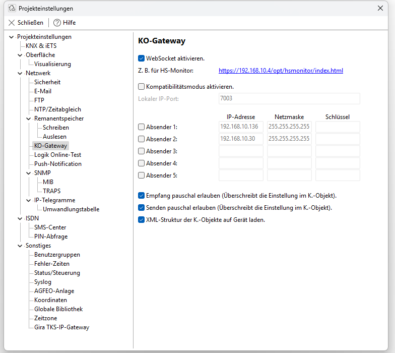
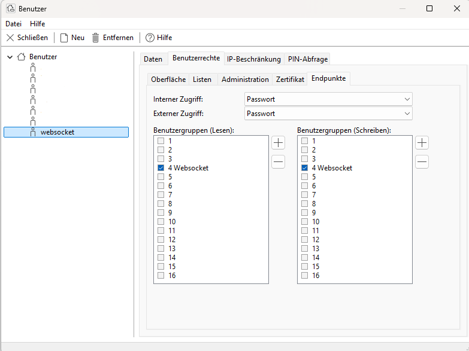
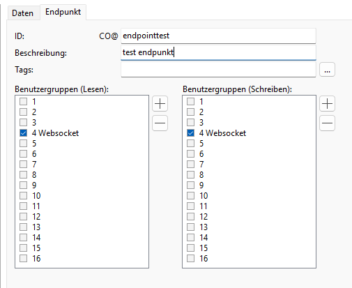

# ioBroker Gira-Endpoint Adapter
## Gira Endpoint Adapter

Der **Gira-Endpoint-Adapter** verbindet ioBroker über **WebSocket (WS/WSS)** mit einem **Gira Homeserver**.  
Damit können Datenpunkte in Echtzeit zwischen dem Homeserver und ioBroker ausgetauscht werden.  

So lassen sich Schaltzustände, Sensorwerte oder Szenen aus dem Gira-System nahtlos in ioBroker integrieren und dort weiterverarbeiten.

### Features
- Verbindung über WebSocket (WS/WSS)
- Senden und Empfangen von Datenpunkten
- Echtzeitkommunikation für schnelle Automatisierungen
- Einfache Integration in bestehende Smart-Home-Szenarien
- Konfigurierbare Mappings zwischen beliebigen ioBroker States und Gira-Endpunkten, wahlweise in beide Richtungen
- Optionale 0/1 ↔ true/false-Umwandlung pro Mapping

### Usage
Eingabewerte können sein:  true | false | toggle | String | Number

- `true` / `false` → werden zu `1` / `0` im HomeServer umgewandelt  
- `toggle` → schaltet den aktuellen Wert im HomeServer um  
- `String` und `Number` → werden direkt durchgereicht  

+## Homeserver konfigurieren
+
+1. **WebSocket in den Projekteinstellungen aktivieren**
+   In den *Projekteinstellungen* unter "KO-Gateway" den WebSocket aktivieren und dem WebSocket-Benutzer Zugriff erlauben.
+   
+
+2. **WebSocket-Benutzer anlegen**  
+   Einen Benutzer z. B. `websocket` erstellen und ihm Lese- und Schreibrechte für die entsprechende Benutzergruppe zuweisen.  
+   
+
+3. **Kommunikationsobjekte freigeben**  
+   Bei jedem benötigten Kommunikationsobjekt die WebSocket-Gruppe sowohl für Lesen als auch Schreiben eintragen.  
+   
+

## Lizenz
[GPLv3](LICENSE)

## Installation von (Github) *Solange noch Beta*

Bis der Adapter Offiziell ist:
Im ioBroker unter Adapter auf den Expertenmodus schalten, Github anklicken und https://github.com/dosordie/ioBroker.gira-endpoint/ bei Benutzerdefiniert eintragen

## Installation (lokal) *Für test ect.*

```bash
Per Tarball installieren 
# im Projektordner
cd ~/iobroker.gira-endpoint
git pull --ff-only
npm run build
npm pack                   # erzeugt z.B. iobroker.gira-endpoint-0.2.0.tgz

# ins ioBroker-Verzeichnis und dort installieren (als iobroker-User)
cd /opt/iobroker
sudo -u iobroker -H npm i --omit=dev ~/iobroker.gira-endpoint/iobroker.gira-endpoint-0.2.0.tgz

# Dateien hochladen & Instanz anlegen
iobroker upload gira-endpoint
## optional hinzufügen
#iobroker add gira-endpoint

```

## Changelog

### 0.2.0
* Added configurable mapping between ioBroker states and Gira endpoints

### 0.1.0
* Adapter basically working and tested

## License
GNU General Public License v3.0

### Grundlage
Der Adapter wurde nachgebaut auf Basis von:  
👉 [node-red-contrib-gira-endpoint](https://github.com/luckyy0815/node-red-contrib-gira-endpoint)

---
